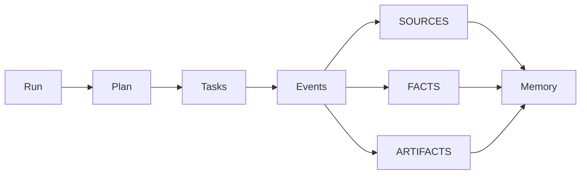
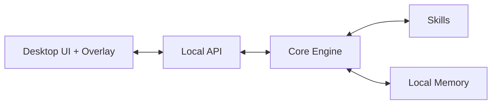

# Randarc-Astra

Локальная станция‑автопилот для задач за компьютером.

Randarc-Astra превращает запрос в управляемый процесс: планирует, исполняет шаги через экран/мышь/клавиатуру, фиксирует события и сохраняет результаты локально. Продукт ориентирован на macOS и работает как «станция», а не как чат.


## Оглавление
- [Что это](#что-это)
- [Как выглядит (станция и оверлей)](#как-выглядит-станция-и-оверлей)
- [Возможности](#возможности)
- [Как пользоваться](#как-пользоваться)
- [Безопасность](#безопасность)
- [Архитектура](#архитектура)
- [Skills](#skills)
- [Локальные данные и приватность](#локальные-данные-и-приватность)
- [Roadmap](#roadmap)
- [Troubleshooting](#troubleshooting)
- [Лицензии и third-party](#лицензии-и-third-party)
- [FAQ](#faq)

## Что это
Randarc-Astra — локальная станция, которая запускает задания как «процессы» (Run), умеет показывать план, прогресс и журнал событий, а также сохраняет результаты в локальную память.

Ключевые папки проекта:
- [apps/desktop](apps/desktop/) — Desktop‑клиент (Tauri + React) и оверлей.
- [apps/api](apps/api/) — локальный API (FastAPI).
- [core](core/) — ядро: Run/Plan/Task/Event и оркестрация.
- [skills](skills/) — набор навыков.
- [memory](memory/) — локальная база и поиск.
- [schemas](schemas/) — JSON‑схемы контрактов.
- [prompts](prompts/) — промты и шаблоны.
- [docs](docs/) — документация.
- [LEGAL](LEGAL/) — third‑party notices.

## Как выглядит (станция и оверлей)
Основной интерфейс — «станция» с планом, задачами, источниками и итогами. Отдельное окно‑оверлей показывает, что делает автопилот прямо поверх экрана.

### Демо
Пока нет встроенных скриншотов.
- TODO: добавить изображения в `docs/media/`.
- Планируемые файлы для вставки: `docs/media/overlay.png`, `docs/media/station.png`.

Пример будущих вставок:
- ``
- ``

## Возможности
Работает сейчас:
- Run/Plan/Task/Event модель с журналом событий.
- Автопилот: цикл «экран → решение → действия → повтор».
- Оверлей поверх экрана с целью, шагом, действиями и статусом.
- Confirm Gate для опасных действий.
- Локальные источники/факты/артефакты и сохранение в память.
- Локальный API, рассчитанный на работу только на `127.0.0.1`.

Планируется / TODO:
- Остановка автопилота при полях пароля/2FA. Пока не реализовано.
- Расширенный анализ контента (например, по аудио/медиа). Пока не реализовано.

## Как пользоваться
1. Открыть станцию Randarc-Astra.
2. Создать проект и ввести запрос.
3. Посмотреть план и запустить выполнение.
4. Наблюдать прогресс в оверлее и в журнале событий.
5. Подтверждать опасные действия через Confirm Gate.
6. Забрать артефакты результата из вкладки «Артефакты».

Быстрый запуск (упрощённо):
```bash
./scripts/run.sh
```

Остановка:
```bash
./scripts/stop.sh
```

Технические детали и настройки — в [docs](docs/).

## Безопасность
- Confirm Gate блокирует опасные действия до ручного подтверждения.
- Команда «Стоп» и глобальная горячая клавиша (Cmd+Shift+S) доступны в оверлее.
- Все действия логируются в событиях.
- Для управления экраном требуются разрешения macOS: Screen Recording и Accessibility.

## Архитектура
### Поток выполнения


### Компоненты


Короткое описание:
- Desktop управляет UX, оверлеем и подтверждениями.
- API связывает интерфейс с ядром и навыками.
- Core держит модель Run/Plan/Task/Event и оркестрацию.
- Skills выполняют конкретные операции.
- Memory хранит результаты локально.

## Skills
| Skill | Назначение | Требует подтверждения |
| --- | --- | --- |
| `autopilot_computer` | Автопилот управления компьютером | да (Confirm Gate внутри) |
| `web_research` | Поиск источников | нет |
| `extract_facts` | Извлечение фактов | нет |
| `conflict_scan` | Поиск конфликтов | нет |
| `report` | Сбор отчёта | нет |
| `memory_save` | Сохранение результатов в память | нет |
| `computer` | Управление ОС | да |
| `shell` | Команды оболочки | да |

## Локальные данные и приватность
- База данных: `.astra/astra.db` (SQLite).
- Шифрованное хранилище секретов: `.astra/vault.bin`.
- Артефакты запусков: `artifacts/<run_id>/`.

Данные остаются локально. Удаление папок `.astra/` и `artifacts/` очищает историю и результаты.

## Roadmap
Ближайшее:
- Улучшение устойчивости автопилота в реальных приложениях. TODO.
- Качественная библиотека демо‑медиа в `docs/media/`. TODO.

Потом:
- Аудио‑интерфейс (STT/TTS). Пока не реализовано.
- Расширенная семантическая память. Пока не реализовано.

## Troubleshooting
- Оверлей не кликается или не управляет мышью: проверь разрешение Accessibility.
- Нет скриншота: проверь разрешение Screen Recording.
- Оверлей не поверх окон: закрой и перезапусти desktop‑приложение.
- Автопилот не действует: проверь, что Confirm Gate не ждёт подтверждения.

## Лицензии и third-party
См. [LEGAL/THIRD_PARTY_NOTICES.md](LEGAL/THIRD_PARTY_NOTICES.md).

## FAQ
**Это облачный сервис?**
Нет, сейчас это локальная станция. Облачный режим не реализован.

**Можно ли запускать без LLM‑провайдера?**
Да, часть навыков работает локально, но автопилот требует LLM для принятия решений.

**Какие ОС поддерживаются?**
На данный момент рабочий режим рассчитан на macOS.

**Где лежат мои данные?**
В `.astra/` и `artifacts/` в корне проекта.

**Почему автопилот не кликает по экрану?**
Чаще всего причина — нет разрешения Accessibility.

**Как остановить автопилот?**
Через кнопку «Стоп» или Cmd+Shift+S.

**Можно ли отключить Confirm Gate?**
Нет, механизм подтверждения обязателен для опасных действий.

**Есть ли встроенные скриншоты?**
Пока нет. Планируются в `docs/media/`.
